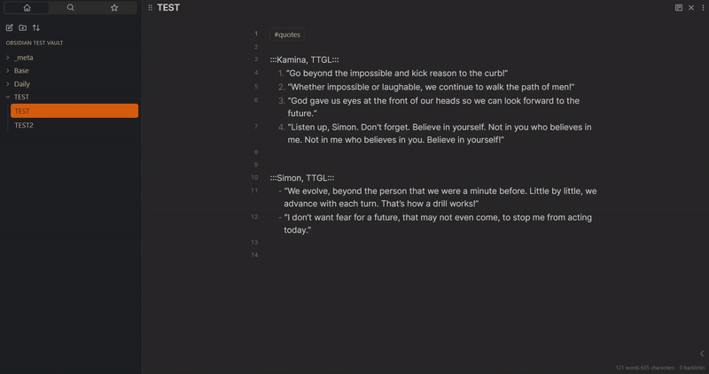

# Local Quotes

Collect your quotes from all over the vault and embed them in different locations.

This plugin allows you to:
- Create quote listings
- Renew your quotes by any interval (minute, day, week, month)
- Apply custom classes to every quote
- Choose your own quote's format



## Quote listing
It's a simple way to collect your quotes. Just surround quote's author's name with
`:::` and start to write the quotes below using list (unordered/ordered). Also, 
your note must have `quotes` tag (can be changed in settings).

Remember that these listings updating only when you open quote codeblock,
but you can also use command `Rescan vault for local quotes`.

## Making quote block
Plugin using codeblock and special codeblock language (`localquote`) to
represent your quote block. There are some settings those allow you to
configure quote block:
- `id` (required) - any string or number for quote identification (`1`,
`d2f`, `my-quote1`).
- `author` (required) - author of quote that you want to see.
- `reload` (optional) - renew interval, when this time passes plugin
will update quote text with another random one (`1m`, `2d`, `30s`, [more 
examples](#reload-intervals))
- `customClass` (optional) - class that can be added to parent div

````
```localquote
id 1
author Kamina, TTGL
reload 1d
customClass my-quote-class
```
````

### Reload intervals
`reload` property uses custom moment.js like syntax. There is all possible
variants (case-sensitive):
- `10s` - equals 10 seconds
- `10m` - equals 10 minutes
- `10h` - equals 10 hours
- `2d` - equals 2 days
- `2w` - equals 2 weeks
- `2M` - equals 2 months
- `1y` - equals 1 year

## Help
If you have any question, feature idea, or you caught a bug, you can create 
[Issue](https://github.com/ka1tzyu/local-quotes/issues) and discuss it with me. I'm beginner so if you have more
experience you can also do [Pull Request](https://github.com/ka1tzyu/local-quotes/pulls.com).

If you want to donate, you can use it:

[](https://www.buymeacoffee.com/ka1tzyu)
