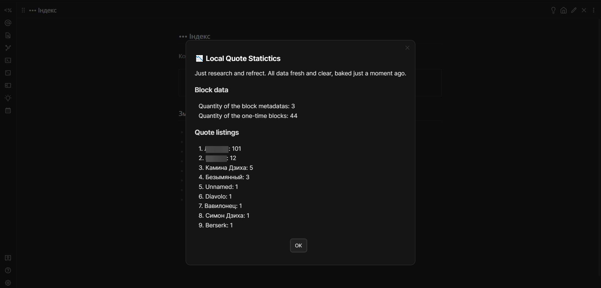

There is another modal `Statistics` that can be opened by using `Open Statistics` command.

It provides information about:

1. Quote quantity for every author
2. Quantity of block metadata in use

### Example
_(muted ones are personal)_

